# SQL

<br>

## 1. Tables temporaires

Les procédures ont été testées avec la base de données [SQL Server](https://www.howtoforge.com/how-to-install-microsoft-sql-server-on-debian-12)
via le client [Azure Data Studio](https://learn.microsoft.com/fr-fr/azure-data-studio/download-azure-data-studio?tabs=win-install%2Cwin-user-install%2Credhat-install%2Cwindows-uninstall%2Credhat-uninstall).

<br>

### 1.1.  Différence entre une table temporaire locale et une table temporaire globale

Les tables temporaires **globales** sont visibles par toutes les sessions (connexions).<br>
Les tables temporaires **locales** ne sont visibles que par la session de l'utilisateur.

<br>

### 1.2. Re-création table temporaire

La table temporaire ne peut être recréé durant une session utilisateur (`PROCEDURE #Niveau2`).<br>
Seules les données de la procédure exécutée (`EXEC #Niveau1`) seront affichées.

<br>

```sql
DROP TABLE IF EXISTS #test;

DROP PROCEDURE IF EXISTS dbo.#Niveau2;
GO

CREATE PROCEDURE #Niveau2
AS
  -- création de la table
  CREATE TABLE #test (ID INT IDENTITY, Code VARCHAR(50))

  -- remplissage de la table
  INSERT INTO #test (Code)
        SELECT 'THIRDPARTY'
  UNION SELECT 'CLUSTER'
  UNION SELECT 'ENTITY'
GO

DROP PROCEDURE IF EXISTS dbo.#Niveau1;
GO

CREATE PROCEDURE #Niveau1
AS
  -- création de la table
  CREATE TABLE #test (ID INT IDENTITY, Code VARCHAR(50))
	
  -- remplissage de la table
  INSERT INTO #test (Code)
  SELECT 'PORTFOLIO'
 
  -- execution d'une sous procédure
  EXEC #Niveau2

  -- visualisation des données
  SELECT ID, Code  FROM #test
GO

EXEC #Niveau1
```

Résultat :

| ID | Code |
|  - | -    |
| 1  | PORTFOLIO |

<br>

### 1.3. TRUNCATE

La table `#test` est vidée par l'instruction `TRUNCATE`, avant l'écriture des trois nouveaux enregistrements (`PROCEDURE #Niveau2`).<br>
La suppression des données de la table `#test` est réalisée après l'écriture du premier enregistrement dans la `PROCEDURE #Niveau1`.

Seules les enregistrements créés après l'instruction `TRUNCATE` dans la `PROCEDURE #Niveau2` seront affichés.

<br>

```sql
DROP TABLE IF EXISTS #test;

DROP PROCEDURE IF EXISTS dbo.#Niveau2
GO

CREATE PROCEDURE #Niveau2
AS
  -- Vidange de la table
  TRUNCATE TABLE #test

  -- remplissage de la table
  INSERT INTO #test (Code)
        SELECT 'THIRDPARTY'
  UNION SELECT 'CLUSTER'
  UNION SELECT 'ENTITY'
GO

DROP PROCEDURE IF EXISTS dbo.#Niveau1;
GO

CREATE PROCEDURE #Niveau1
AS
  -- création de la table
  CREATE TABLE #test (ID INT IDENTITY, Code VARCHAR(50))
	
  -- remplissage de la table
  INSERT INTO #test (Code)
  SELECT 'PORTFOLIO'
 
  -- execution d'une sous procédure
  EXEC #Niveau2

  -- visualisation des données
  SELECT ID, Code FROM #test
GO

EXEC #Niveau1
```

Résultat :

| ID | Code |
|  - | -    |
|  1 | CLUSTER    |
|  2 | ENTITY     |
|  3 | THIRDPARTY |

<br>

---

## 2. Case

Les requêtes ont été testées avec la base de données [SQL Server](https://www.howtoforge.com/how-to-install-microsoft-sql-server-on-debian-12)
via le client [Azure Data Studio](https://learn.microsoft.com/fr-fr/azure-data-studio/download-azure-data-studio?tabs=win-install%2Cwin-user-install%2Credhat-install%2Cwindows-uninstall%2Credhat-uninstall).

Le caractère **%** correspond à une chaîne de caractère quelconque.

<br>

```sql
DECLARE @test VARCHAR(50) = 'PORTFOLIO_TRANSACTION'
SELECT CASE WHEN @test LIKE 'TRANSACTION%' THEN 1
WHEN @test LIKE 'PORTFOLIO%' THEN 2
WHEN @test LIKE 'PORTFOLIO%TRANSACTION' THEN 3
ELSE 4 END 'TRANSACTION';
```

<br>

La requête renvoie la première correspondance trouvée.

| TRANSACTION |
| - |
| 2 | 

<br>

---

## 3. Clauses SQL

Les requêtes ont été testées avec la base de données [SQL Server](https://www.howtoforge.com/how-to-install-microsoft-sql-server-on-debian-12)
via le client [Azure Data Studio](https://learn.microsoft.com/fr-fr/azure-data-studio/download-azure-data-studio?tabs=win-install%2Cwin-user-install%2Credhat-install%2Cwindows-uninstall%2Credhat-uninstall).

### 3.1. Ordre d'apparition dans un *SELECT*

| Clauses  | Ordre |
|   -      | -     |
| FROM     |  2    |
| ORDER BY |  6    |
| HAVING   |  5    |
| GROUP BY |  4    |
| SELECT   |  1    |
| WHERE    |  3    |

<br>

### 3.2. Ordre d'évaluation d'un un *SELECT*

Production d'un jeu de données à analyser.

```sql
DROP TABLE IF EXISTS #test;
CREATE TABLE #test ( id INT IDENTITY, code VARCHAR(50));
INSERT INTO #test( code )
SELECT 'THIRDPARTY' UNION ALL
SELECT 'CLUSTER' UNION ALL SELECT 'CLUSTER' UNION ALL SELECT 'CLUSTER' UNION ALL
SELECT 'ENTITY' UNION ALL SELECT 'ENTITY';
```

<br>

Requête à analyser.

```sql
SELECT code, Count(code) "Count"
FROM #test
WHERE code IN ('CLUSTER', 'ENTITY')
GROUP BY code
HAVING Count(*) > 1
ORDER BY code;
```

<br>

Plan d'exécution de la requête.

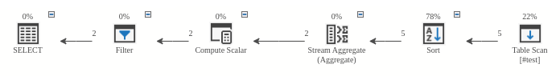

| Traitement  | Description | Clause |
|   -    |      -      |   -    |
| Filter | <ins>**Filtrage**</ins> sur le nombre maximum de "***code* regroupés**", au niveau de la clause *HAVING* (**Filtrage** `Count(*) > 1`)  | *HAVING* |
| Compute Scalar | <ins>**Calcul**</ins> le nombre de "***code* regroupés**", au niveau des clause *HAVING* et *SELECT* (**Calcul** `Count(*)`) | *COUNT* |
| Stream Aggregate | **Regroupement** sur de champ *code* | *GROUP BY* |
| Sort |  **Tri** sur le champ *code*  | *ORDER BY* |
| Table Scan *#test* | Récupération des *code* de types '*CLUSTER*' ou '*ENTITY*' | *FROM*, *WHERE* |

<br>

Ordre d'exécution de la requête.

| Clauses  | Ordre |
|   -      | -     |
| FROM     |  1   |
| ORDER BY |  3   |
| HAVING   |  5   |
| GROUP BY |  4   |
| SELECT   |  6   |
| WHERE    |  2   |

<br>

### 3.3. Filtrage dynamique

Production d'un jeu de données.

```sql
DROP TABLE IF EXISTS #account;
CREATE TABLE #account ( ID INT IDENTITY, AccountName VARCHAR(10) );

INSERT INTO #account(AccountName)
SELECT 'ACOUNT1' UNION ALL SELECT 'ACOUNT2' UNION ALL
SELECT 'ACOUNT3' UNION ALL SELECT 'ACOUNT4';
```

<br>

La requête doit retourner tous les enregistrements lorsque le critère de recherche `@userFilter` sur l'*ID* est **NULL**.

Valeur de `@userFilter` appartenant au jeu de données.

```sql
DECLARE @userFilter INT = 2

SELECT ID, AccountName
FROM #account
WHERE (ID = @userFilter OR ISNULL(@userFilter,99) = IIF(ISNULL(@userFilter,99) = 99, 99, 100));
```

Résultat :

| ID | AccountName |
| -  | -  |
| 2  | ACOUNT2 |

<br>

Valeur de `@userFilter` à NULL.

```sql
DECLARE @userFilter INT = NULL

SELECT ID, AccountName
FROM #account
WHERE (ID = @userFilter OR ISNULL(@userFilter,99) = IIF(ISNULL(@userFilter,99) = 99, 99, 100));
```

Résultat :

| ID | AccountName |
| -  | -  |
| 1  | ACOUNT1 |
| 2  | ACOUNT2 |
| 3  | ACOUNT3 |
| 4  | ACOUNT4 |

<br>

---

<br>

## 4. Différence entre DELETE et un TRUNCATE

Les requêtes ont été testées avec la base de données [SQL Server](https://www.howtoforge.com/how-to-install-microsoft-sql-server-on-debian-12)
via le client [Azure Data Studio](https://learn.microsoft.com/fr-fr/azure-data-studio/download-azure-data-studio?tabs=win-install%2Cwin-user-install%2Credhat-install%2Cwindows-uninstall%2Credhat-uninstall).


<br>

Un `TRUNCATE` supprime toutes les lignes d’une table ou des partitions spécifiées d’une table, sans journaliser les suppressions de ligne individuelles.<br>
Un `TRUNCATE TABLE` est similaire à l’instruction `DELETE` sans la clause `WHERE`.<br>
Toutefois un `TRUNCATE TABLE` est plus rapide et utilise moins de ressources système et de journal des transactions.

<br>

```sql
DROP TABLE IF EXISTS #test;
CREATE TABLE #test (ID INT IDENTITY, Code VARCHAR(50))

-- remplissage de la table
INSERT INTO #test (Code)
SELECT 'PORTFOLIO'

-- Début de la transaction
BEGIN TRANSACTION Transaction1

-- vidange de la table
TRUNCATE TABLE #test

-- remplissage de la table
INSERT INTO #test (Code)
SELECT 'CLUSTER'

-- Retourne à l'état d'avant la TRANSACTION
ROLLBACK

GO


-- visualisation des données
SELECT ID, Code FROM #test
```

La requête renvoie les données <ins>d'avant le debut de la TRANSACTION</ins>.<br>
:warning: On constate qu'il est ici possible de récupérer les données du première enregistrement malgré le `TRUNCATE`.


| ID | Code |
| -  | -  |
| 1  | PORTFOLIO |

<br>

---

<br>

## 5. Jointures

Les requêtes ont été testées avec la base de données [SQLite](https://sqlitebrowser.org/) 
(release [3-13-1](https://sqlitebrowser.org/blog/version-3-13-1-released/)).


### 5.1. Diagrammes à deux cercle

Les noms des tables et des champs ci-dessous ont été armonisés/re-écris afin de faciliter la compréhension des traitements.

```sql
CREATE TABLE #Table1(ID INT, Code VARCHAR(50))
CREATE TABLE #Table2(ID INT, DefaultLabel VARCHAR(200))
```

Tous les cas de figure seront traités.

**Pas uniquement ceux du test :**

- [Données communes entre les deux tables](#5123-donn%C3%A9es-communes-des-tables-t1-et-t2)

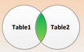

- [Données de la table *T1*](#5121-donn%C3%A9es-de-la-table-t1)

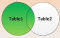

- [Données exclusivement liées à la table T1 ou à la table T2](#5127-donn%C3%A9es-exclusivement-li%C3%A9es-%C3%A0-la-table-t1-ou-%C3%A0-la-table-t2)

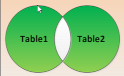

<br>

#### 5.1.1. Création des tables

Production d'un jeu de données.

```sql
DROP TABLE IF EXISTS "T1";
DROP TABLE IF EXISTS "T2";

CREATE TABLE "T1" ("ID"	INTEGER,"STR" TEXT);
CREATE TABLE "T2" ("ID"	INTEGER,"STR" TEXT);

INSERT INTO T1 VALUES (1, 'A'), (2, 'B'), (3, 'C'), (4, 'D'), (5, 'E'), (6, 'F'), (7, 'G');
INSERT INTO T2 VALUES (8, 'H'), (9, 'I'), (3, 'J'), (4, 'K'), (5, 'L'), (13, 'M'), (14, 'N');
```

<br>

##### 5.1.1.1. Association

Les données communes sont associées deux à deux pour éviter une duplication liée à un produit cartésien.

| T1.ID | T1.STR | T2.ID | T2.STR |
| - | - | -  | - |
| 1 | A |  8 | H |
| 2 | B |  9 | I |
| 3 | C |  3 | J |
| 4 | D |  4 | K |
| 5 | E |  5 | L |
| 6 | F | 13 | M |
| 7 | G | 24 | N |

Données communes.

| ID | T1 | T2 |
| - | - | - |
| 3 | C | J |
| 4 | D | K |
| 5 | E | L |


Répartition des données sur un diagramme de *Venn*.

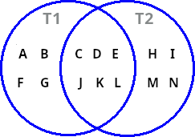

Les trois espaces du diagramme induisent $\frac{1 - 2^{3+1}}{1 - 2}=7$ combinaisons possibles.

<br>

#### 5.1.2. Sélection des données

##### 5.1.2.1. Données de la table *T1*


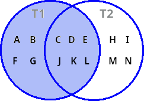

Requête :

```sql
SELECT T1.STR "T1", T2.STR "T2" 
FROM T1 
LEFT JOIN T2 ON T1.ID=T2.ID 
ORDER BY T1.STR, T2.STR;
```

Résultat :

| T1 | T2 |
| -  | -  |
| A  |    |
| B  |    |	
| C  | J  |
| D  | K  |
| E  | L  |
| F  |    |
| G  |    |

<br>

##### 5.1.2.2. Données de la table *T2*

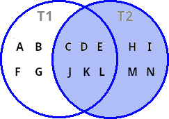

Requête :

```sql
SELECT T1.STR "T1", T2.STR "T2" 
FROM T1 RIGHT 
JOIN T2 ON T1.ID=T2.ID 
ORDER BY T1.STR, T2.STR;
```

Résultat :

| T1 | T2 |
| -  | -  |
|    | H  |
|    | I  |
|    | M  |
|    | N  |
| C  | J  |
| D  | K  |
| E  | L  |

<br>

##### 5.1.2.3. Données communes des tables *T1* et *T2* 

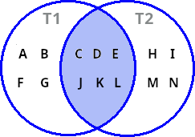

###### 5.1.2.3.1. Avec jointure 

Requête :

```sql
SELECT T1.STR "T1", T2.STR "T2" 
FROM T1 
INNER JOIN T2 ON T1.ID=T2.ID 
ORDER BY T1.STR, T2.STR;
```

Résultat :

| T1 | T2 |
| -  | -  |
| C  |	J |
| D  |	K |
| E  |	L |


###### 5.1.2.3.1. Sans jointure

Requête :

```sql
SELECT T1.ID, T1.STR
FROM T1
WHERE EXISTS (
  SELECT T2.ID
  FROM T2
  WHERE T1.ID=T2.ID
)
ORDER BY T1.STR;
```

Résultat :

| ID | STR |
| - | - |
| 3 | C |
| 4 | D |
| 5 | E |

<br>

##### 5.1.2.4. Données exclusivement liées à la table *T1*

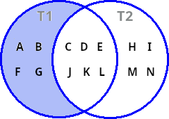

Requête :

```sql
SELECT T1.STR "T1", T2.STR "T2" 
FROM T1 LEFT 
JOIN T2 ON T1.ID=T2.ID 
WHERE T2.STR IS NULL 
ORDER BY T1.STR, T2.STR;
```

Résultat :

| T1 | T2 |
| -  | -  |
| A  |    |
| B  |    |
| F  |    |
| G  |    |

<br>

##### 5.1.2.5. Données exclusivement liées à la table *T2*

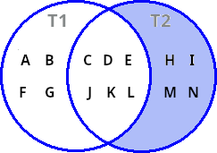

Requête :

```sql
SELECT T1.STR "T1", T2.STR "T2" 
FROM T1
RIGHT JOIN T2 ON T1.ID=T2.ID 
WHERE T1.STR IS NULL 
ORDER BY T1.STR, T2.STR;
```

Résultat :

| T1 | T2 |
| -  | -  |
|    |  H |
|    |  I |
|    |  M |
|    |  N |

<br>

##### 5.1.2.6. Totalité de la base de données

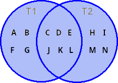

Requête :

```sql
SELECT T1.STR "T1", T2.STR "T2" 
FROM T1 
FULL OUTER JOIN T2 ON T1.ID=T2.ID 
ORDER BY T1.STR, T2.STR;
```

Résultat :

| T1 | T2 |
| -  | -  |
|    |  H |
|    |  I |
|    |  M |
|    |  N |
| A  |    |
| B  |    |	
| C  |	J |
| D  |	K |
| E  |  L |
| F  |    |
| G  |    |	

<br>

##### 5.1.2.7. Données exclusivement liées à la table *T1* ou à la table *T2*

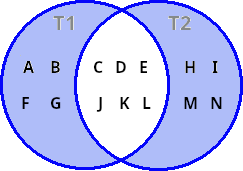

Requête :

```sql
SELECT T1.STR "T1", T2.STR "T2" 
FROM T1 
FULL OUTER JOIN T2 ON T1.ID=T2.ID 
WHERE (T1.STR IS NULL OR T2.STR IS NULL) 
ORDER BY T1.STR, T2.STR;
```

Résultat :

| T1 | T2 |
| -  | -  |
|    |  H |
|    |  I |
|    |  M |
|    |  N |
| A  |    |
| B  |    |
| F  |    |
| G  |    |	

<br>

### 5.2. Diagrammes à trois cercle

Les noms des tables et des champs ci-dessous ont été armonisés/re-écris afin de faciliter la compréhension des traitements.

```sql
CREATE TABLE #Table1(ID INT, Code VARCHAR(50))
CREATE TABLE #Table2(ID INT, DefaultLabel VARCHAR(200))
CREATE TABLE #Table3(ID INT, DefaultDescription VARCHAR(1000))
```


On sélectionnera deux diagragrames.


- [Données de la table *T1*](#5221-données-de-la-table-t1)

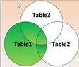


- [Union de l'intersection entre les tables *T1*, *T2* et de l'intersection entre les tables *T1*, *T3*](#5222-union-de-lintersection-entre-les-tables-t1-t2-et-de-lintersection-entre-les-tables-t1-t3)

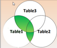

<br>

#### 5.2.1. Création des tables

Production d'un jeu de données.

```sql
DROP TABLE IF EXISTS "T1";
DROP TABLE IF EXISTS "T2";
DROP TABLE IF EXISTS "T3";

CREATE TABLE "T1" ("ID"	INTEGER,"STR" TEXT);
CREATE TABLE "T2" ("ID"	INTEGER,"STR" TEXT);
CREATE TABLE "T3" ("ID"	INTEGER,"STR" TEXT);

INSERT INTO T1 VALUES (1, 'A'), (2, 'B'), (3, 'C'), (4, 'D'),  (5, 'E'),  (6, 'F'), (7, 'G'), (8, 'H');
INSERT INTO T2 VALUES (9, 'I'), (10, 'J'), (11, 'K'), (4, 'L'), (5, 'M'), (6, 'N'), (15, 'O'), (16, 'P');
INSERT INTO T3 VALUES (17, 'Q'), (18, 'R'), (19, 'S'),  (7, 'T'), (8, 'U'), (6, 'V'), (15, 'W'), (16, 'X');
```

<br>

##### 5.2.1.1. Association

Les données communes sont associées deux à deux pour éviter une duplication liée à un produit cartésien.

| T1.ID | T1.STR | T2.ID | T2.STR | T3.ID | T3.STR |
| - | - | -   | -  | -  | -  |
| 1 | A |  9  | I  | 17 | Q  |
| 2 | B | 10  | J  | 18 | R  |
| 3 | C | 11  | K  | 19 | S  |
| 4 | D |  4  | L  |  7 | T  |
| 5 | E |  5  | M  |  8 | U  |
| 6 | F |  6  | N  |  6 | V  |
| 7 | G | 15  | O  | 15 | W  |
| 8 | H | 16  | P  | 16 | X  |


Données communes aux table *T1* et *T2*.

| ID | T1 | T2 |
| - | - | -  |
| 4 | D | L  |
| 5 | E | M  |
| 6 | F | N  |

Données communes aux table *T1* et *T3*.

| ID | T1 | T3 |
| - | - | -  |
| 6 | F | V  |
| 4 | G | T  |
| 5 | H | U  |

Données communes aux table *T2* et *T3*.

| ID | T2 | T3 |
| -  | - | -  |
|  6 | N | V  |
| 15 | O | W  |
| 16 | P | X  |


Répartition des données sur un diagramme de *Venn*.

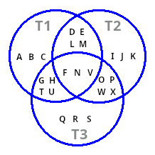

Les sept espaces du diagramme induisent $\frac{1 - 2^{7+1}}{1 - 2}=127$ combinaisons possibles.

<br>

#### 5.2.2. Sélection des données

##### 5.2.2.1. Données de la table *T1*

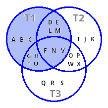

Requête :

```sql
SELECT T1.STR "T1", T2.STR "T2", T3.STR "T2"
FROM T1 
LEFT JOIN T2 ON T1.ID=T2.ID
LEFT JOIN T3 ON T1.ID=T3.ID
ORDER BY T1.STR, T2.STR, T3.STR;
```

Résultat :

| T1 | T2 | T3 |
| -  | -  | -  |
| A  |    |    |
| B  |    |    |
| C  |    |    |
| D  | L  |    |
| E  | M  |    |
| F  | N  | V  |
| G  |	  | T  |
| H  |    | U  |

<br>

##### 5.2.2.2. Union de l'intersection entre les tables *T1*, *T2* et de l'intersection entre les tables *T1*, *T3* 

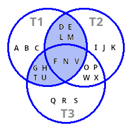

Requête :

```sql
SELECT T1.STR "T1", T2.STR "T2", T3.STR "T3"
FROM T1 
LEFT JOIN T2 ON T1.ID=T2.ID 
LEFT JOIN T3 ON T1.ID=T3.ID
WHERE (T2 IS NOT NULL OR T3 IS NOT NULL)
ORDER BY T1.STR, T2.STR, T3.STR;
```

Résultat :

| T1 | T2 | T3 |
| -  | -  | -  |
| D  | L  |    |
| E  | M  |    |
| F  | N  | V  |
| G  |    | T  |
| H  |    | U  |

<br>

---

<br>

## 6. Fonctions de classement

Les requêtes ont été testées avec la base de données [SQLite](https://sqlitebrowser.org/) 
(release [3-13-1](https://sqlitebrowser.org/blog/version-3-13-1-released/)).


Création d'un jeu de données.

```sql
DROP TABLE IF EXISTS "VENTES";
CREATE TABLE "VENTES" ("ID" INTEGER ,"PRENOM" TEXT ,"NOM" TEXT, "MOIS" INTEGER, "CA" INTEGER);
INSERT INTO "VENTES" ("ID", "PRENOM", "NOM", "MOIS", "CA") VALUES 
(1, 'Hélene', 'Bonnet', 5, 2300),
(2, 'Marie', 'Martin', 5, 2400),
(3, 'Hélene', 'Bonnet', 6, 2700),
(4, 'Marie', 'Martin', 6, 2700),
(5, 'Alexandre', 'Durand', 6, 2900),
(6, 'Marie', 'Martin', 7, 1200),
(7, 'Hélene', 'Bonnet', 7, 1200),
(8, 'Alexandre', 'Durand', 7, 1000);
```
 
<br>


Requête de classement des données selon le CA décroissant avec ajout d'un *ROWNUM*.

```sql
SELECT ID, PRENOM, NOM, MOIS, CA,
ROW_NUMBER () OVER ( ORDER BY CA DESC ) CLASSEMENT
FROM VENTES;
```

Résultat :

| ID | PRENOM | NOM | MOIS | CA | CLASSEMENT |
| - | -         | -      | - | -    | - |
| 5 | Alexandre | Durand | 6 | 2900 | 1 |
| 3 | Hélene    | Bonnet | 6 | 2700 | 2 |
| 4 | Marie     | Martin | 6 | 2700 | 3 |
| 2 | Marie     | Martin | 5 | 2400 | 4 |
| 1 | Hélene    | Bonnet | 5 | 2300 | 5 |
| 6 | Marie     | Martin | 7 | 1200 | 6 |
| 7 | Hélene    | Bonnet | 7 | 1200 | 7 |
| 8 | Alexandre | Durand | 7 | 1000 | 8 |

<br>

---

<br>

## 7. SQL Profiler


La répartition des consomations des traitements peut être visualisée à travers un plan d'exécution.


Analyse des procédures du traitement de [re-création d'une table temporaire](#12-re-création-table-temporaire).


Consommation de la `PROCEDURE #Niveau1`.

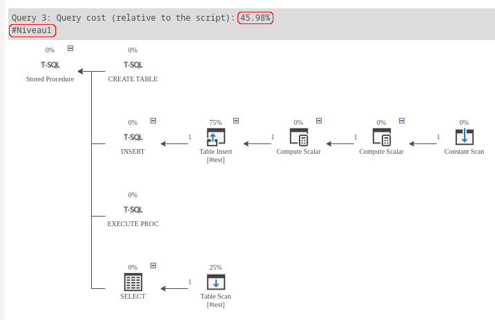
 
 Consommation de la `PROCEDURE #Niveau2`.
 
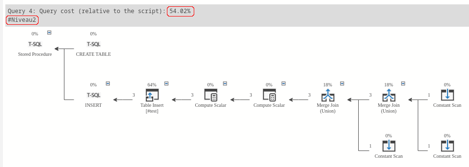
 
 <br>
 
Les informations brutes de traitement peuvent être obtenues en lançant la procédure `EXEC #Niveau1` de la façon suivante : 
 
```sql
SET statistics io ON
SET statistics time ON
EXEC #Niveau1
SET statistics io OFF
SET statistics time OFF
```

<br>

---

<br>

## 7. Index

- Un index **non-cluster** stocke les données et les index à des emplacements
différents. Un index contient des pointeurs vers l'emplacement de ces données.

- Un index **cluster** définit l'ordre dans lequel les données sont stockées dans la table
qui ne peut être triée que d'une seule manière. Il ne peut y avoir qu'un seul cluster index par table.


