# SQL

Les requêtes ont été testées avec la base de données [SQLite](https://sqlitebrowser.org/) 
avec la release [3-13-1](https://sqlitebrowser.org/blog/version-3-13-1-released/).


## 1. Diagrammes à deux cercle

### 1.1. Création des tables

```sql
DROP TABLE IF EXISTS "T1";
DROP TABLE IF EXISTS "T2";

CREATE TABLE "T1" ("ID"	INTEGER,"STR" TEXT);
CREATE TABLE "T2" ("ID"	INTEGER,"STR" TEXT);

INSERT INTO T1 VALUES (1, 'A'), (2, 'B'), (3, 'C'), (4, 'D'), (5, 'E'), (6, 'F'), (7, 'G');
INSERT INTO T2 VALUES (8, 'H'), (9, 'I'), (3, 'J'), (4, 'K'), (5, 'L'), (13, 'M'), (14, 'N');
```

#### 1.1.1. Association

Les données communes sont associées deux à deux pour éviter une duplication liée au produit cartésien.

| T1.ID | T1.STR | T2.ID | T2.STR |
| - | - | -  | - |
| 1 | A |  8 | H |
| 2 | B |  9 | I |
| 3 | C |  3 | J |
| 4 | D |  4 | K |
| 5 | E |  5 | L |
| 6 | F | 13 | M |
| 7 | G | 24 | N |

Données communes.

| ID | T1 | T2 |
| - | - | - |
| 3 | C | J |
| 4 | D | K |
| 5 | E | L |


Répartition des données sur un diagramme de *Venn*.

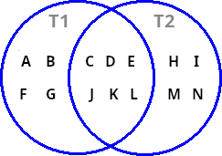

<br>

---

<br>

### 1.2. Sélection des données

Les trois espaces du diagramme induisent $\frac{1 - 2^{3+1}}{1 - 2}=7$ combinaisons possibles.

#### 1.2.1. Données de la table *T1*

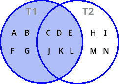

Requête :

```sql
SELECT T1.STR "T1", T2.STR "T2" 
FROM T1 
LEFT JOIN T2 ON T1.ID=T2.ID 
ORDER BY T1.STR, T2.STR;
```

Résultat :

| T1 | T2 |
| -  | -  |
| A  |    |
| B  |    |	
| C  | J  |
| D  | K  |
| E  | L  |
| F  |    |
| G  |    |

---

#### 1.2.2. Données de la table *T2*

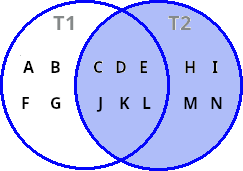

Requête :

```sql
SELECT T1.STR "T1", T2.STR "T2" 
FROM T1 RIGHT 
JOIN T2 ON T1.ID=T2.ID 
ORDER BY T1.STR, T2.STR;
```

Résultat :

| T1 | T2 |
| -  | -  |
|    |	H |
|    |	I |
| C  |	J |
| D  |	K |
| E  |	L |
|    |	M |
|    |	N |

---

#### 1.2.3. Données communes des table *T1* et *T2* 

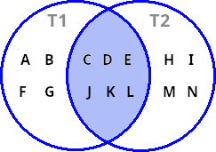

Requête :

```sql
SELECT T1.STR "T1", T2.STR "T2" 
FROM T1 
INNER JOIN T2 ON T1.ID=T2.ID 
ORDER BY T1.STR, T2.STR;
```

Résultat :

| T1 | T2 |
| -  | -  |
| C  |	J |
| D  |	K |
| E  |	L |

---

#### 1.2.4. Données exclusivement liées à la table *T1*

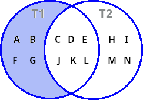

Requête :

```sql
SELECT T1.STR "T1", T2.STR "T2" 
FROM T1 LEFT 
JOIN T2 ON T1.ID=T2.ID 
WHERE T2.STR IS NULL 
ORDER BY T1.STR, T2.STR;
```

Résultat :

| T1 | T2 |
| -  | -  |
| A  |    |
| B  |    |
| F  |    |
| G  |    |

---

#### 1.2.5. Données exclusivement liées à la table *T2*

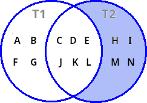

Requête :

```sql
SELECT T1.STR "T1", T2.STR "T2" 
FROM T1
RIGHT JOIN T2 ON T1.ID=T2.ID 
WHERE T1.STR IS NULL 
ORDER BY T1.STR, T2.STR;
```

Résultat :

| T1 | T2 |
| -  | -  |
|    |  H |
|    |  I |
|    |  M |
|    |  N |

---

#### 1.2.6. Totalité de la base de données

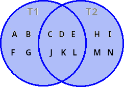

Requête :

```sql
SELECT T1.STR "T1", T2.STR "T2" 
FROM T1 
FULL OUTER JOIN T2 ON T1.ID=T2.ID 
ORDER BY T1.STR, T2.STR;
```

Résultat :

| T1 | T2 |
| -  | -  |
|    |  H |
|    |  I |
|    |  M |
|    |  N |
| A  |    |
| B  |    |	
| C  |	J |
| D  |	K |
| E  |  L |
| F  |    |
| G  |    |	

---

#### 1.2.7. Données exclusivement liées à la table *T1* ou à la table *T2*

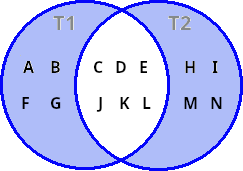

Requête :

```sql
SELECT T1.STR "T1", T2.STR "T2" 
FROM T1 
FULL OUTER JOIN T2 ON T1.ID=T2.ID 
WHERE (T1.STR IS NULL OR T2.STR IS NULL) 
ORDER BY T1.STR, T2.STR;
```

Résultat :

| T1 | T2 |
| -  | -  |
|    |  H |
|    |  I |
|    |  M |
|    |  N |
| A  |    |
| B  |    |
| F  |    |	
| G  |    |	

---

<br>

## 2. Diagrammes à trois cercle


### 2.1. Création des tables

```sql
DROP TABLE IF EXISTS "T1";
DROP TABLE IF EXISTS "T2";
DROP TABLE IF EXISTS "T3";

CREATE TABLE "T1" ("ID"	INTEGER,"STR" TEXT);
CREATE TABLE "T2" ("ID"	INTEGER,"STR" TEXT);
CREATE TABLE "T3" ("ID"	INTEGER,"STR" TEXT);

INSERT INTO T1 VALUES (1, 'A'), (2, 'B'), (3, 'C'), (4, 'D'),  (5, 'E'),  (6, 'F'), (7, 'G'), (8, 'H');
INSERT INTO T2 VALUES (9, 'I'), (10, 'J'), (11, 'K'), (4, 'L'), (5, 'M'), (6, 'N'), (15, 'O'), (16, 'P');
INSERT INTO T3 VALUES (17, 'Q'), (18, 'R'), (19, 'S'),  (7, 'T'), (8, 'U'), (6, 'V'), (15, 'W'), (16, 'X');
```

#### 2.1.1. Association

Les données communes sont associées deux à deux pour éviter une duplication liée au produit cartésien.

| T1.ID | T1.STR | T2.ID | T2.STR | T3.ID | T3.STR |
| - | - | -   | -  | -  | -  |
| 1 | A |  9  | I  | 17 | Q  |
| 2 | B | 10  | J  | 18 | R  |
| 3 | C | 11  | K  | 19 | S  |
| 4 | D |  4  | L  |  7 | T  |
| 5 | E |  5  | M  |  8 | U  |
| 6 | F |  6  | N  |  6 | V  |
| 7 | G | 15  | O  | 15 | W  |
| 8 | H | 16  | P  | 16 | X  |


Données communes aux table *T1* et *T2*.

| ID | T1 | T2 |
| - | - | -  |
| 4 | D | L  |
| 5 | E | M  |
| 6 | F | N  |

Données communes aux table *T1* et *T3*.

| ID | T1 | T3 |
| - | - | -  |
| 6 | F | V  |
| 4 | G | T  |
| 5 | H | U  |

Données communes aux table *T2* et *T3*.

| ID | T2 | T3 |
| -  | - | -  |
|  6 | N | V  |
| 15 | O | W  |
| 16 | P | X  |


Répartition des données sur un diagramme de *Venn*.

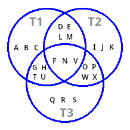

<br>

---

<br>

### 2.2. Sélection des données

Les sept espaces du diagramme induisent $\frac{1 - 2^{7+1}}{1 - 2}=127$ combinaisons possibles.

On en sélectionnera deux.


#### 2.2.1. Données de la table *T1*

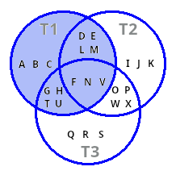

Requête :

```sql
SELECT T1.STR "T1", T2.STR "T2", T3.STR "T2"
FROM T1 
LEFT JOIN T2 ON T1.ID=T2.ID
LEFT JOIN T3 ON T1.ID=T3.ID
ORDER BY T1.STR, T2.STR, T3.STR;
```

Résultat :

| T1 | T2 | T3 |
| -  | -  | -  |
| A  |    |    |
| B  |    |    |
| C  |    |    |
| D  | L  |    |
| E  | M  |    |
| F  | N  | V  |
| G  |	  | T  |
| H  |    | U  |

---

#### 2.2.2. Union de l'intersection entre les tables *T1*, *T2* et de l'intersection entre les tables *T1*, *T3* 

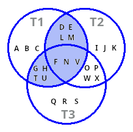

Requête :

```sql
SELECT T1.STR "T1", T2.STR "T2", T3.STR "T3"
FROM T1 
LEFT JOIN T2 ON T1.ID=T2.ID 
LEFT JOIN T3 ON T1.ID=T3.ID
WHERE (T2 IS NOT NULL OR T3 IS NOT NULL)
ORDER BY T1.STR, T2.STR, T3.STR;
```

Résultat :

| T1 | T2 | T3 |
| -  | -  | -  |
| D  | L  |    |
| E  | M  |    |
| F  | N  | V  |
| G  |    | T  |
| H  |    | U  |


